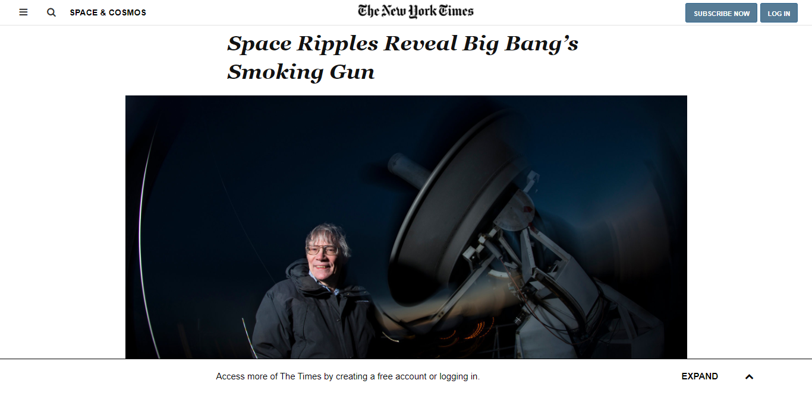

# New-York-Times-Clone
> This project consists of a New York Times
article page that matches this [appearance](https://www.nytimes.com/2014/03/18/science/space/detection-of-waves-in-space-buttresses-landmark-theory-of-big-bang.html?_r=0).



## Project Requirements

### General
- You can find the original project specification at [The Odin Project](https://www.theodinproject.com/courses/html5-andcss3/lessons/positioning-and-floating-elements).

### Specific to Microverse
- Please use ```<aside>``` tag for Editor's picks section on the rightmost side.
- Elements aligned with a combination of all three techniques (Float, Flex and Grid).
- WARNING: Make sure you access to NYT article page NOT using Incognito mode, otherwise you will see a different version of the page.

## Built With

- HTML
- CSS

## Dependencies

> Refer to [Linters Config](https://github.com/eananti/linters-config/tree/master/html-css) for project setup guide.

## Live Demo

[Live Demo Link](https://eananti.github.io/New-York-Times-Clone/)

## Authors

👤 **Author1**

- Github: [@eananti](https://github.com/eananti)
- Twitter: [@e_ananti](https://twitter.com/e_ananti)
- Linkedin: [Emeka Ananti](https://www.linkedin.com/in/emekaananti/)

👤 **Author2**

- Github: [@Ceejayski](https://github.com/ceejayski)
- Twitter: [@Ceejaski1](https://twitter.com/Ceejayski1)
- Linkedin: [Okoli Chijioke](https://www.linkedin.com/in/okolichijioke/)

## Show your support

Give a ⭐️ if you like this project!
